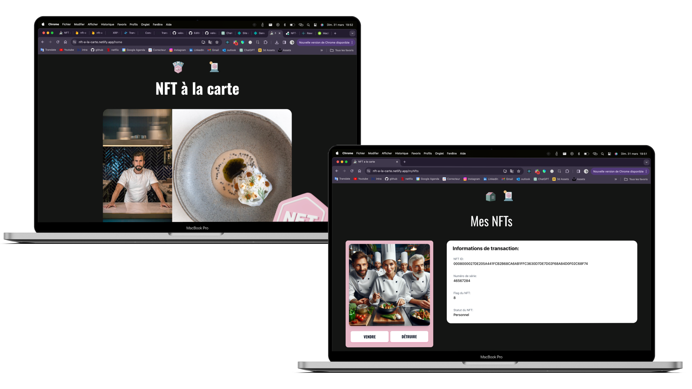
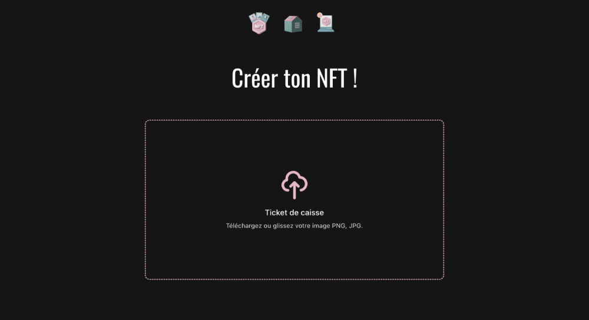

<h1 align="center"> 🍽️  NFT à la carte  💻 </h1>  

    

  Un site de création, de vente et d'échange de NFTs autour du milieu de la restauration de luxe

## 👨🏽‍💻 Mon projet

Imaginez une soirée mémorable dans un restaurant étoilé au Michelin, où chaque plat est une œuvre d'art et chaque bouchée est une explosion de saveurs. Mais une fois le repas terminé, que reste-t-il ? Des souvenirs fugaces, quelques photos sur votre téléphone, et une digestion lente. 📸🍴

Et si nous pouvions transformer cette expérience éphémère en quelque chose de tangible, quelque chose de réellement unique et précieux ? C'est là que les NFTs entrent en jeu. 🖼️

Avec notre projet, vous pouvez immortaliser votre expérience culinaire en transformant votre ticket de caisse du restaurant en un NFT. Notre IA génère une image unique du chef et du plat décrit sur votre ticket, créant ainsi un token numérique représentant cette expérience gastronomique exceptionnelle. 🎨

Ces NFTs ajoutent une dimension supplémentaire de luxe et d'exclusivité à votre repas, tout en offrant la possibilité de valoriser encore davantage votre souvenir. Qui sait, ces tokens pourraient devenir extrêmement précieux à la mort du chef ou à la fermeture du restaurant. 💎

## 👨🏻‍🏫 Le sujet Epitech

🚀 Objective:
The objective of this project is to develop a tokenized asset management platform on the XRP Ledger, allowing users to tokenize real-world assets and trade them securely.

🔍 Project Scope:
The project will focus on creating a platform where users can tokenize a specific real-world asset (RWA), such as real estate property, artwork, or collectibles, and represent ownership of these assets as digital tokens on the XRP Ledger. The platform will include features for token issuance, ownership management, and trading of tokenized assets through a user-friendly interface.

🗝️ Key Features:
- Tokenization of Real-World Assets: Users can tokenize a specific real-world asset by providing relevant details and initiating the tokenization process on the platform.
- Frontend Interface: The platform will have a user-friendly frontend interface where users can view tokenized assets, manage their ownership, and trade tokens on the XRP Ledger.
- Token Trading Marketplace: A marketplace feature will allow users to list their tokenized assets for sale and participate in trading activities with other users on the platform.

🔐 To go further :
- Security and Compliance: The platform will implement security measures to protect user data and transactions, ensuring compliance with regulatory requirements specific to the XRP Ledger.

🈲 Technologies Used:
- XRP Ledger: Utilized for token issuance, ownership management, and trading of tokenized assets.
- Frontend Development: Frontend interface developed using technologies like React.js for seamless integration with the XRP Ledger.
- APIs: Integration with XRP Ledger APIs for seamless interaction with the blockchain.

📘 Deliverables:
- Fully functional tokenized asset management platform deployed on the XRP Ledger.
- User documentation and guides for platform usage.
- Presentation and demonstration of the platform's features and functionalities.

## 🈵 Les technos
 

  
  
  
  

 
Pour interagir avec le XRP Ledger, j'utilise le client JavaScript XRP. Le front-end est développé en React, tandis que le back-end et les interactions avec Firestore sont gérés en Node.js.

## 🖥️ Ma solution

---

---

---

---

## 🧪 Tests

Pour garantir la fiabilité et la robustesse de ma solution, j'ai effectué environ 1000 lignes de tests approfondis sur le serveur backend en Node.js à l'aide de Mocha. Ces tests couvrent toutes les interactions avec Firestore et le XRP Ledger de toutes les routes de l'application.

J'ai mis en place des scénarios de test complets pour chaque fonctionnalité, en simulant diverses situations et en vérifiant les réponses et les comportements attendus. Cela permet de m'assurer que l'application fonctionne de manière optimale et qu'elle répond aux exigences des utilisateurs.

Ces tests garantissent non seulement la qualité du code, mais aussi la stabilité et la fiabilité de l'application dans des conditions réelles d'utilisation. Cela me permet de livrer une expérience utilisateur sans faille et de garantir la sécurité et l'intégrité des données de nos utilisateurs. 🛠️
